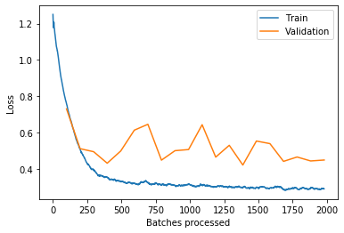
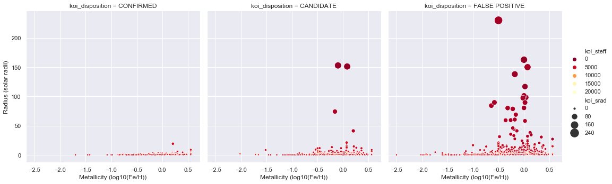
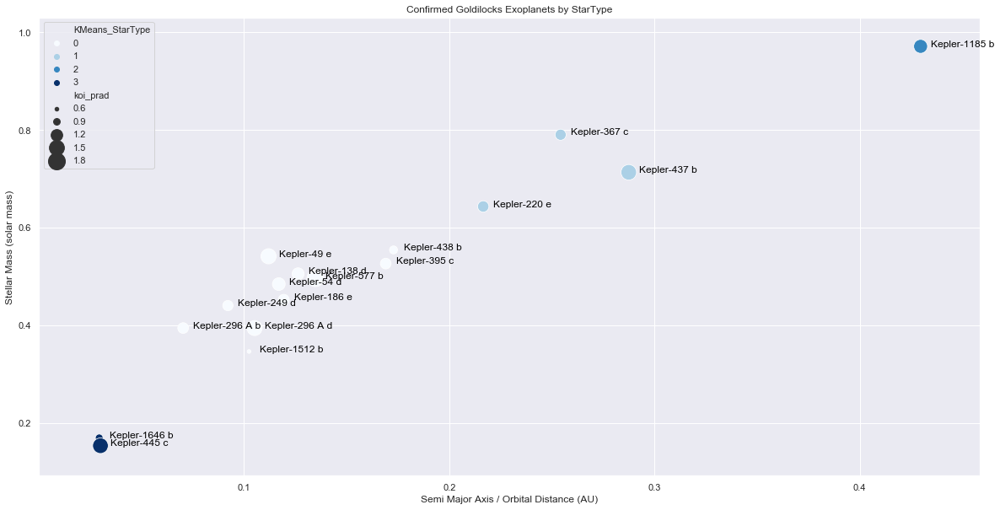
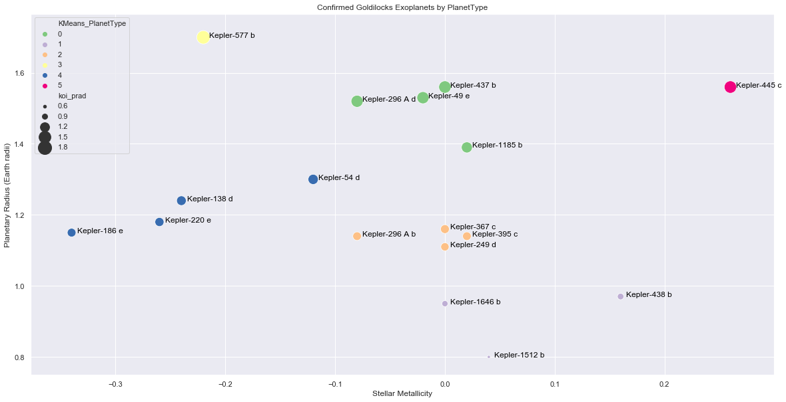
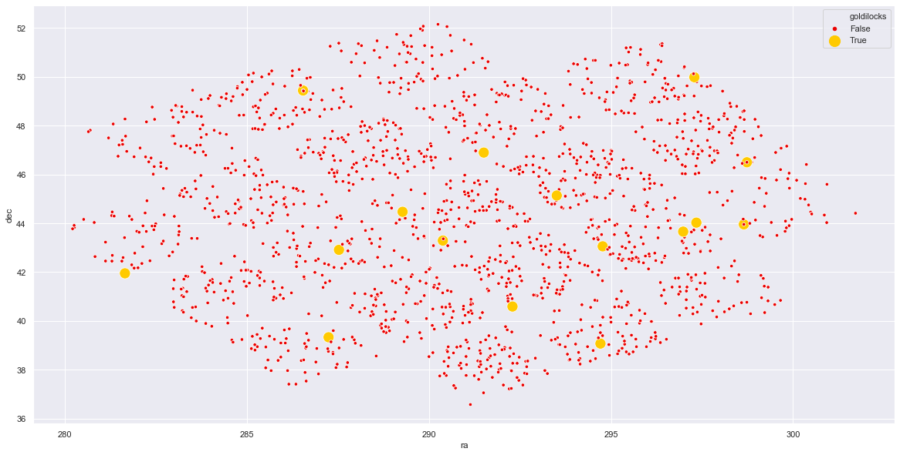

# Exploratory Data Analysis - Kepler Object of Interest Dataset

The Kepler Space telescope was designed to survey a small section of the sky (105 deg^2 = 1/400th of sky),
using the transit method to discover Earth-size exoplanets in or near habitable zone 
and estimate how many stars in the Milky Way have such planets.

During its over nine and a half years of service, Kepler observed 530,506 stars and detected 2,662 planets.

## Notebooks
- [0_Keplar_Tabular_View.ipynb](0_Keplar_Tabular_View.ipynb)
- [1_Exoplanet_Archive_Information.ipynb](1_Exoplanet_Archive_Information.ipynb)
- [2_Disposition_Correlations.ipynb](2_Disposition_Correlations.ipynb)
- [3_Disposition_Prediction_Fastai_1_Subsection.ipynb](3_Disposition_Prediction_Fastai_1_Subsection.ipynb)
- [3_Disposition_Prediction_Fastai_2_Full_Table.ipynb](3_Disposition_Prediction_Fastai_2_Full_Table.ipynb)
- [4_Starmap.ipynb](4_Starmap.ipynb)
- [4_Stellar_Scatter_Plots.ipynb](4_Stellar_Scatter_Plots.ipynb)
- [5_Exoplanet_Habitability.ipynb](5_Exoplanet_Habitability.ipynb)

## Dataset
 
- Dataset:
    - Data Source: https://exoplanetarchive.ipac.caltech.edu/cgi-bin/TblView/nph-tblView?app=ExoTbls&config=cumulative 
        - ./data/kepler_koi.csv = CSV, All Columns, All Rows, Values Only
    - Column Defintions: https://exoplanetarchive.ipac.caltech.edu/docs/API_kepcandidate_columns.html

- Kepler Information:
    - Other Kepler Datasets: https://exoplanetarchive.ipac.caltech.edu/docs/ICEexohelp.html
    - Kepler NASA Mission Page: https://www.nasa.gov/mission_pages/kepler/main/index.html
    - Wikipedia - Kepler Space Telescope: https://en.wikipedia.org/wiki/Kepler_space_telescope
    
- Exoplanet Information:
    - Youtube - How to Find an Exoplanet: https://www.youtube.com/watch?v=ahX_0XHp1vM
    - Transit Method - Light Curve Tutorial: https://www.cfa.harvard.edu/~avanderb/tutorial/tutorial.html
    - Methods of Detecting Explanets: https://www.planetary.org/explore/space-topics/exoplanets/how-to-search-for-exoplanets.html
    

## Data Cleanup

- Notebook: [0_Keplar_Tabular_View.ipynb](0_Keplar_Tabular_View.ipynb)
- Preprocessing code: [./src/dataset_koi.py](./src/dataset_koi.py)

Preprocessing:
- Dataset was split by columns into conceptual groupings (`id`, `archive`, `disposition`, `transit`, `TCE`, `stellar`, `KIC`, `pixels`) based on the [dataset column definitions](https://exoplanetarchive.ipac.caltech.edu/docs/API_kepcandidate_columns.html)   
- Pandas datatypes where manually assigned to columns where autodetection failed: `category`, `datetime64`, `uint8`
- `.fillna(0 or '')` was applied to a small number of columns: `koi_score`, `koi_comment`, `koi_tce_delivname`
- `koi_fpflag_nt` contained an erroneous 4, thus needed to be mapped back to a boolean int
- 4 categorical columns contained quarterly timestamp information such as `q1_q17_dr25_stellar` where simplified via regexp: `re.sub(r'_(q|dr)\d+|(q|dr)\d+_', '', str)`
- 14 columns contained either only NaNs or a single value, thus where excluded as they contained no useful information
- 2 columns contained URL data, which was excluded as being irrelevant to the current exploration

OneHot Encoding [2_Disposition_Correlations.ipynb](2_Disposition_Correlations.ipynb):
- `koi_disposition` was OneHot encoded using `pd.get_dummies()` for correlation analysis
- `koi_comment` was string split on '---' and OneHot/Binary encoded into 124 unique comment_flag columns    

## Exoplanet Archive Information
- Notebook: [1_Exoplanet_Archive_Information.ipynb](1_Exoplanet_Archive_Information.ipynb)

**Basic Statistics:**
- Number of KOIs             9564
- Number of Solar Systems    8214
- Number of Named Planets    2305

**KOI Dispositions:**

**Questions and Answers:**
- Are All Named Planets Confirmed?
    - There are two named false positives: Kepler-469b + Kepler-503b
- Are Confirmed Planets Named?
    - All confirmed planets have been named

Google Fu has a little more information on these named False Positives

Kepler-469 b: https://twitter.com/exohugh/status/1169262460504875008 
<blockquote>
Twitter: Hugh Osborn @exohugh - Sep 4, 2019
    
He [Alexandre Santerne] also kills Kepler-469b which is a validated Kepler planet yet is clearly a binary fold in the wrong period. #PlatoESP
</blockquote>

Kepler-503 b: https://arxiv.org/abs/1805.08820
<blockquote>
arxiv: Kepler-503b: An Object at the Hydrogen Burning Mass Limit Orbiting a Subgiant Star
</blockquote>

## Disposition Correlations

- Notebook: [2_Disposition_Correlations.ipynb](2_Disposition_Correlations.ipynb)

Observations: 
- In the vast majority of cases the presence of fpflags or comments is used to indicate the reason for a FALSE POSITIVE
    - fpflags - only in 19 (0.2%) cases, does a single fpflag refer to a CONFIRMED or CANDIDATE exoplanets
    - comments - only 1408 (10%) of comments are used in labelling CONFIRMED or CANDIDATE exoplanets       
    
- Correlation between fpflags    
    - There is mild anti-correlation between: koi_fpflag_nt + koi_fpflag_ss
        - A Stellar Eclipse has Transit like properties
    - There is high correlation between: koi_fpflag_co + koi_fpflag_ec
        - A Centroid Pixel Offset is a common cause of Contamination
    
- Correlation of Comment Flags with Disposition
    - The vast majority of comment flags are correlated with FALSE POSITIVE and half anti-correlated with CONFIRMED or CANDIDATE
    - As observed above, 90% of comments are used to label FALSE POSITIVE
    - The fields that most correlate with CANDIDATE, are also those which have the greatest difference in correlation with CONFIRMED
        - These all seem to flag having too little information about a KOI
    - According the [documention](https://exoplanetarchive.ipac.caltech.edu/docs/API_kepcandidate_columns.html), FALSE POSITIVE can occur when:
        - 1) the KOI is in reality an eclipsing binary star
        - 2) the Kepler light curve is contaminated by a background eclipsing binary
        - 3) stellar variability is confused for coherent planetary transits
        - 4) instrumental artifacts are confused for coherent planetary transits
    - The FALSE POSITIVE flags seem to be related to tests for these conditions
    - The CONFIRMED flags seem to be related to tests for ruling out these these conditions

## Disposition Prediction using Fastai Machine Learning
- Notebook: [3_Disposition_Prediction_Fastai_1_Subsection.ipynb](3_Disposition_Prediction_Fastai_1_Subsection.ipynb)
- Notebook: [3_Disposition_Prediction_Fastai_2_Full_Table.ipynb](3_Disposition_Prediction_Fastai_2_Full_Table.ipynb)
    
A machine learning Neural Network model was trained to predict KOI disposition, with: 
- 83.3% accuracy - Using only fpflags and comments as input
- 89.6% accuracy - Using the full dataset

## Starmap
- Notebook: [4_Starmap.ipynb](4_Starmap.ipynb)

Star Observations:
- The bottom right of the grid is closest to the Galactic Rim, thus has a greater overall star density
- Visually there appears to be a greater ratio of CONFIRMED to FALSE POSITIVE away from the Galactic Rim

Map Observations:
- Each square represents the stationary field of view of the Kepler Space Telescope
- Kepler was repointed 21 times in a grid search pattern during its 9 year mission
- The slight curvature of the grid represents the projection of a sphere onto a flat surface

## Stellar Scatter Plots
- Notebook: [4_Stellar_Scatter_Plots.ipynb](4_Stellar_Scatter_Plots.ipynb)

**Correlation with Laws of Physics:**
- As expected by the laws of physics (more fuel = hotter and bigger)
  - Stellar Mass (koi_smass) is strongly correlated with Surface Temperature (koi_steff)
  - Stellar Mass (koi_smass) is also correlated with Metallicity (koi_smet) and Radius (koi_srad)
  - Radius (koi_srad) - and by extension Stellar Mass - is anti-correlated with log10 Surface Gravity (koi_slogg) 
    
- Differences in correlations between ALL -> CONFIRMED:
  - Mass/Radius = increases in correlation
  - Metallicity/Radius = uncorrelated for ALL | correlated for CONFIRMED
  - Metallicity/Gravity + Temperature/Gravity = increase in anti-correlatedness 
  - Temperature/Radius + Temperature/Metallicity = anti-correlated for ALL | correlated for CONFIRMED
  
Metallicity vs Radius - correlated for CONFIRMED - uncorrelated for ALL  

- Exoplanets are found more often around high-metalicity stars (more material for rocky planets)
- Large Red Giants have a minimum metalicity threshold (nuclear astrophysics)

Temperature vs Radius - anti-correlated for ALL | correlated for CONFIRMED

- Exoplanets are found more often around small low-temperature stars

## Exoplanet Habitability

A key goal of the Kepler Space Telescope is to determine how many Earth-size and larger planets there are in or near the habitable zone (often called "Goldilocks planets") of a wide variety of spectral types of stars.

We start with 2303 CONFIRMED exoplanets. Different planet types include: 
- [Super-Earth](https://en.wikipedia.org/wiki/Super-Earth) below 10$M_e$ with a radius of 0.8-1.25$R_e$ - exactly what we are looking for
- Earth Sized [Ocean_planet](https://en.wikipedia.org/wiki/Ocean_planet) would have a much lower density - but could potentually harbour life
- [Carbon planet](https://en.wikipedia.org/wiki/Carbon_planet) low density diamonds in the sky - may lack enough oxgyen to have water
- Gaseous [Mini-Neptunes](https://en.wikipedia.org/wiki/Mini-Neptune) require a minimum radius of 1.7$R_e$
- Small [Sub Earths](https://en.wikipedia.org/wiki/Sub-Earth) under 0.8$R_e$, likely lack the gravity and magnetic fields to sustain a habitable atmosphere
- [List of potentially habitable exoplanets](https://en.wikipedia.org/wiki/List_of_potentially_habitable_exoplanets) only lists exoplanets in the range of 0.78-1.63$E_r$, which mostly agrees with the 0.8-1.7$E_r$ range suggested above

The first criteria for a earth-like habitable planet is liquid water, which would require a `koi_teq` Equilibrium Temperature (Kelvin) within the range 273.2K - 373.2K. 
- Exoplanets that are too cold  :   50 ( 2.17%)
- Exoplanets that are just right:  110 ( 4.78%)
- Exoplanets that are too hot   : 2142 (93.01%)

Lacking a formal density measurement from the KOI table, the closest proxy is `koi_prad` Planetary Radius (Earth radii).  Applying the range of 0.8-1.7$E_r$ as a second criteria: 
- Exoplanets that are too small :   56 ( 2.43%)
- Exoplanets that are just right:  713 (30.96%)
- Exoplanets that are too big   : 1550 (67.30%)

These limits can then be combined together:
- Exoplanets that are "just right" temp      :  110 ( 4.78%)
- Exoplanets that are "just right" size      :  713 (30.96%)
- Exoplanets that are "just right" combined  :   17 ( 0.74%)

Names of potentually habitable exoplanets: 
- Kepler-1185 b, Kepler-138 d, Kepler-1512 b, Kepler-1646 b, Kepler-186 e, Kepler-220 e, Kepler-249 d, Kepler-296 A b, Kepler-296 A d, Kepler-367 c, Kepler-395 c, Kepler-437 b, Kepler-438 b, Kepler-445 c, Kepler-49 e, Kepler-54 d, Kepler-577 b

#### KMeans StarType - Orbital Distance vs Stellar Mass

Plotting the Goldilocks Exoplanets against Stellar Mass and Orbital Distance.

There is a strong linear correlation between the Stellar Mass (and by extension Surface Temperature), with the Orbital Radius of the Habitable Zone

Within the correlation, there still appears to be 4 distinct clusters, possibly indicating different classes of [Red Dwarfs](https://en.wikipedia.org/wiki/Red_dwarf) and [Main Sequence](https://en.wikipedia.org/wiki/Main_sequence) stars

#### KMeans PlanetType - Planetary Radius vs Stellar Metallicity 

Plotting Planetary Radius against Stellar Metallicity, may provide insight groupings into planet composition, 
as high-metal stars are more likely to form rocky planets, rather than water/ice worlds or carbon planets

#### Starmap - Where are my habitable exoplanets?

Location of goldilocks exoplanets in the night sky

